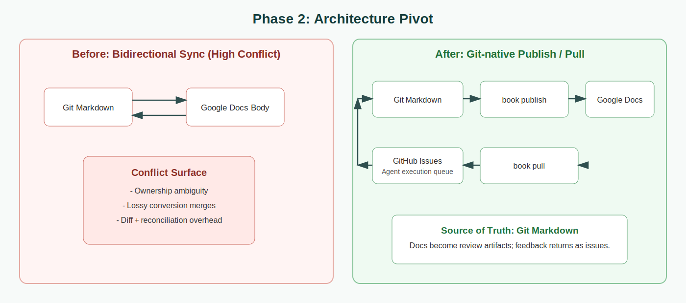
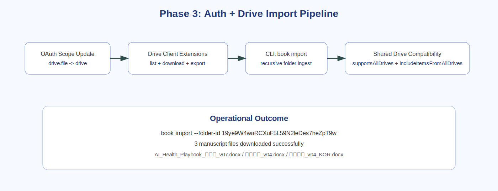
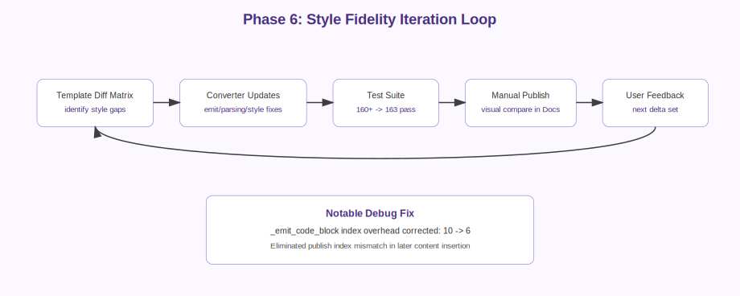

# AI-based Book Publish Solution

`bookbook` is a Git-native book production system that keeps markdown as source of truth, publishes review-ready Google Docs, and converts review feedback into GitHub issues for AI-assisted execution.

## What Bookbook Solves

- Build a practical workflow to write a full book with AI in markdown while running human collaboration in Google Docs. [1](https://github.com/modocai/history_yc_book_project/blob/main/result/2026-02-05-bookbook-gitnative-copilot.txt.txt#L13)[2](https://github.com/modocai/history_yc_book_project/blob/main/result/2026-02-05-bookbook-gitnative-copilot-en.txt#L1)
- Keep authoring, review, and execution connected without manual copy/paste drift between files, docs, and task tracking. [2](https://github.com/modocai/history_yc_book_project/blob/main/result/2026-02-05-bookbook-gitnative-copilot-en.txt#L1)

## Product Model (Final)

- Git markdown is the source of truth.
- `book publish` creates a new date/versioned Google Docs output for review.
- `book pull` ingests review signals (comments/suggestions) into GitHub issues for AI-agent execution.
- The final model intentionally drops full bidirectional body sync to reduce conflict complexity at the system level. [5](https://github.com/modocai/history_yc_book_project/blob/main/result/2026-02-05-bookbook-gitnative-copilot-en.txt#L109)[6](https://github.com/modocai/history_yc_book_project/blob/main/result/2026-02-05-bookbook-gitnative-copilot-en.txt#L120)

## Build Timeline

### Phase 1 — Initial Requirements and Planning

- Project kickoff defined markdown-first authoring, Google Docs collaboration, and structured chapter/section organization. [2](https://github.com/modocai/history_yc_book_project/blob/main/result/2026-02-05-bookbook-gitnative-copilot-en.txt#L1)
- Initial planning established CLI-first operation and implementation sequencing. [3](https://github.com/modocai/history_yc_book_project/blob/main/result/2026-02-05-bookbook-gitnative-copilot-en.txt#L34)

### Phase 2 — Architecture Pivot to Git-native Publish/Pull

- The initial sync-heavy approach was replaced with a simpler publish/pull model.
- The critical decision was to treat Docs as publish/review artifacts, not as a second editable source of truth. [4](https://github.com/modocai/history_yc_book_project/blob/main/result/2026-02-05-bookbook-gitnative-copilot-en.txt#L94)[5](https://github.com/modocai/history_yc_book_project/blob/main/result/2026-02-05-bookbook-gitnative-copilot-en.txt#L109)

### Phase 3 — Core Implementation (Auth, Drive, Import)

- OAuth scope was expanded from `drive.file` to `drive` to access user-uploaded files. [7](https://github.com/modocai/history_yc_book_project/blob/main/result/2026-02-05-bookbook-gitnative-copilot-en.txt#L547)
- Drive client support was extended for export/download flows and richer listing metadata (`mimeType`). [8](https://github.com/modocai/history_yc_book_project/blob/main/result/2026-02-05-bookbook-gitnative-copilot-en.txt#L643)
- `book import` was added as a recursive ingest path for Drive folders.
- Shared-drive visibility issues were debugged and resolved using all-drives flags. [9](https://github.com/modocai/history_yc_book_project/blob/main/result/2026-02-05-bookbook-gitnative-copilot-en.txt#L861)
- Import execution completed with three manuscript files downloaded. [10](https://github.com/modocai/history_yc_book_project/blob/main/result/2026-02-05-bookbook-gitnative-copilot-en.txt#L911)

### Phase 4 — Shipping Hygiene and Safe Commit Boundary

- Secret handling was explicitly reviewed before commit (`client_secret.json` excluded). [11](https://github.com/modocai/history_yc_book_project/blob/main/result/2026-02-05-bookbook-gitnative-copilot-en.txt#L937)
- Feature changes were committed with targeted scope (`ff11b10`). [12](https://github.com/modocai/history_yc_book_project/blob/main/result/2026-02-05-bookbook-gitnative-copilot-en.txt#L954)
- Credentials paths were added to `.gitignore` to harden baseline repository safety. [13](https://github.com/modocai/history_yc_book_project/blob/main/result/2026-02-05-bookbook-gitnative-copilot-en.txt#L965)

### Phase 5 — Writing Operations at Scale (Issues + Project System)

- The writing workflow was operationalized with EN parent issues + KO sub-issues, chapter/part/language/type labels, and project field automation. [14](https://github.com/modocai/history_yc_book_project/blob/main/result/2026-02-05-bookbook-gitnative-copilot-en.txt#L1009)[15](https://github.com/modocai/history_yc_book_project/blob/main/result/2026-02-05-bookbook-gitnative-copilot-en.txt#L1016)
- Sub-issue linkage failures were debugged by switching to numeric issue DB IDs and correct API typing. [16](https://github.com/modocai/history_yc_book_project/blob/main/result/2026-02-05-bookbook-gitnative-copilot-en.txt#L1095)
- Final verification confirmed complete EN/KO pairing and expected issue counts. [17](https://github.com/modocai/history_yc_book_project/blob/main/result/2026-02-05-bookbook-gitnative-copilot-en.txt#L1132)[18](https://github.com/modocai/history_yc_book_project/blob/main/result/2026-02-05-bookbook-gitnative-copilot-en.txt#L1157)

### Phase 6 — Style Fidelity Loop for Publish Quality

- A dedicated style-matching cycle was defined against a template diff matrix (thematic break, body spacing/color, blockquote, code block rendering). [19](https://github.com/modocai/history_yc_book_project/blob/main/2026-02-06-styletemplate-test.txt#L7)[20](https://github.com/modocai/history_yc_book_project/blob/main/2026-02-06-styletemplate-test.txt#L249)
- Iterative updates increased coverage and produced stable pass states (160+ -> 163 tests) with manual publish verification. [21](https://github.com/modocai/history_yc_book_project/blob/main/2026-02-06-styletemplate-test.txt#L718)[24](https://github.com/modocai/history_yc_book_project/blob/main/2026-02-06-styletemplate-test.txt#L1835)
- A latent index accounting bug in `_emit_code_block` was identified and corrected (overhead 10 -> 6). [22](https://github.com/modocai/history_yc_book_project/blob/main/2026-02-06-styletemplate-test.txt#L921)[23](https://github.com/modocai/history_yc_book_project/blob/main/2026-02-06-styletemplate-test.txt#L928)

## What Shipped

- A Git-native book production model (`publish`/`pull`) aligned to AI-authoring plus human review.
- Working Drive import/export path with shared-drive compatibility.
- Hardened commit hygiene for secrets and generated artifacts.
- Scalable chapter execution system via automated GitHub issue/project operations.
- Style fidelity workflow that links visual diffs to converter fixes, tests, and publish validation.

## Source Links

- Repository root: https://github.com/modocai/history_yc_book_project
- This submit file: https://github.com/modocai/history_yc_book_project/blob/main/result/submit_ai_book_publish_solution_v2.md
- Core source (EN build transcript): https://github.com/modocai/history_yc_book_project/blob/main/result/2026-02-05-bookbook-gitnative-copilot-en.txt
- Core source (KO build transcript): https://github.com/modocai/history_yc_book_project/blob/main/result/2026-02-05-bookbook-gitnative-copilot.txt.txt
- Core source (StyleTemplate loop): https://github.com/modocai/history_yc_book_project/blob/main/2026-02-06-styletemplate-test.txt

Private repository (reference only):
- https://github.com/modocai/Book_HealthcareAI_for_Consumer (private)
